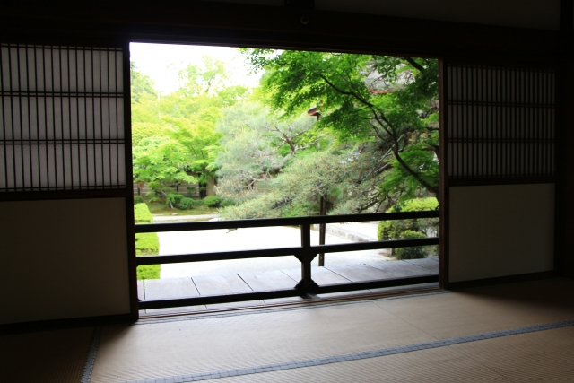
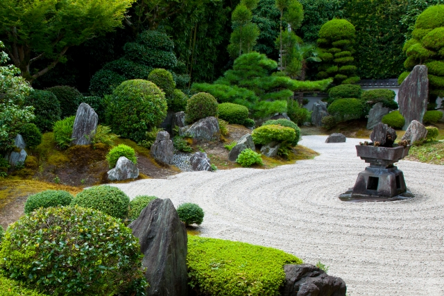
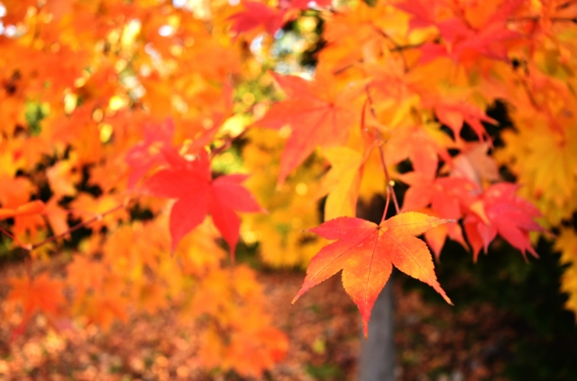
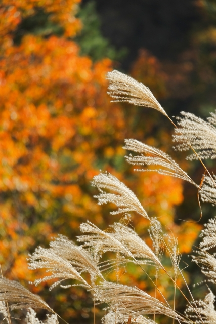

+++
title = "ما الـ«وابي سابي»؟"
date = 2025-06-11
description = "شرحٌ لمقاييس الجمال عند أهل اليابان"

[extra]
banner_label = false
show_banner_on_index = true
toc = true
+++

أما إذا تدبّرت أواني الشاي العادية أو تلمّحتَ جنانًا تكتنفُها السكينة؛ استحسنتَ جمالًا عجيبًا  تَقصُر عنها العبارة؛ إلا أهل اليابان = فقد اصطلحوا تسمية في لسانهم وقالوا: «وابي سابي».

ولعلّك تحسبُ أنّ في لفظها من الغرابة ما عند اليابان وحدها؟ فمضمونها أدّق مسلكًا وأبعد غاية وأرفع من أن يُحاط بها إدراك العوام.

فقد جرت هذه التسمية في سُنن مشاربتهم[^1] وبدائع بساتينهم التي تتجلّى فيها المحاسن على غير تكلّفٍ وتفيض بالسكينة والوقار.

وها نحن نبتغي الكشف عن أصول هذا المعنى، مستضيئين برحلةٍ تجمع العقل والذوق لعلّنا نُميط اللثام عن بعض أسرارها ونكشف ما استغلق من حقائقها.
## الوابي سابي

لفظٌ درج على ألسنة اليابانيين يُعبّر عن جمال لا يُدرك بالنظَر إلى البهرجة والزينة، بل يقوم على الرضا بالقليل والتسليم لما في الشيء من نقصٍ وسكون حتى كأنّ الجمال عندهم فيما خفَّ لا ما ثَقُل.

وليس الـ«وابي سابي» اسم مفرد، بل هو مركّب من كلمتين: **وابي (侘び)** و**سابي (寂び)** ولكلٍّ منهما معنى يخصّه.

## تفصيلهما

### معنى وابي (侘び)

فهو اسمٌ مشتقٌّ من فعل وله وجهان في المعنى كما جاء في كتبهم:

أوّلهما: الكآبة وما يعرض للمرء من ضيق الخاطر وحزن القلب.

وثانيهما:  ما استقر في نفوس أهل الأدب والشعر وأهل صناعة الشاي من السكون والعفّة حيث يُستحبّ التواضع في الهيئة والبُعد عن البذخ والركون إلى الصمت والرضا. وهي في [قاموس بحر الكلمات العميق](https://shinjikai.app): *ميل للبساطة والهدوء، اعتدال*.

فأصل اللفظ أُطلق على من لم يُدرك غايته فحزن وأسِف وفقد الأمل. ولكن بتغيّر الزمن تبدّل المعنى وصار منذ [عهد مُرومَتْشِيْ](https://ar.wikipedia.org/wiki/%D9%81%D8%AA%D8%B1%D8%A9_%D9%85%D9%88%D8%B1%D9%88%D9%85%D8%A7%D8%AA%D8%B4%D9%8A) القبول بما قُدّر ووِضَع وصفًا لنفسٍ رضيَت بما أُتيح لها ووجدت الغنى في القناعة والجمال في الصمت والسكينة في عزوفها عن زخرف الحياة.

وهو إذ ذاك تعبيرٌ عن ثراء النفس يُدركه من صفا قلبُه وسكنت رغباته وتطهّرت نظرته إلى ما حوله من دنيا ناقصةٍ لا كمال فيه.
### وأمّا سابي (寂び)

جاء في معجمهم الأكبر أنها كلمة من أعمدة الذوق الرفيع في تراث اليابان وتُضرب مثلًا في الجما
ل المركّب الذي يجمع بين الوقار والتقشّف وبين أثر الزمن وهدوء الأشياء فتكون بهيّةً بما شاخت جميلةً بما ذبلت حسنةً بما خلت من الزينة. وهي في قاموس بحر الكلمات العميق: *مَظهر عَتيق. (صوت) خافِت. بساطة وأناقة، فن يجمع بين البساطة والأناقة*.

وقد دلّ على قِدم هذا المفهوم أنّ الشاعر الياباني [تُشِنَرِي بن فُجِيوَرَ](https://ja.wikipedia.org/wiki/%E8%97%A4%E5%8E%9F%E4%BF%8A%E6%88%90) (ت 1204) قد نظم أشعارًا فيها ذكر الـ«سابي». واستُعملت في مسابقات الشعر في زمنه؛ إذ يُقسَّم الشعراء فيها إلى فريقين يتبارون ويتذاكرون.

**فالوابي** تدل على حال النفس ورضاها، و**السابي** هي صورة واقعة يظهر فيها آثار الزمن على الأشياء فيكسوها مهابة ووقارًا يجعل الصمت فيها بيانًا.

وامتد هذا الذوق وازداد بدخول أصحاب الزّن؛  وهي طائفة اتخذت مذهبًا بوذيًا جاء من بلاد الصين فوافق هوى اليابانيين من محاربين ومفكّرين وتلاقى مع ما فيهم من قناعة وتأمل فانبثق منه ذوق الـ«وابي سابي» على تمامه وخاصة في **عهد مُرومَتْشِيْ** حين صارت حدائق الحجارة ورسوم الرمال وصمت الأشياء من أعظم ما يُعبّر به عن جمال الفكرة وعمق الروح.

### كيف يُستعمل لفظ الـ«وابي سابي»؟

وبعد أن تبيّن لنا أصلهما وعُرف معناهما في ميزان الذوق والفكر، فإنّ السؤال الذي يعرض للناظر: كيف يُستعمل هذا اللفظ؟ ومتى يُقال؟

**مثاله الأول:**  
أن تنظر إلى معبد قديم قد أكل الدهر بعض جدرانه ونالت الرطوبة من خشبه وغطّ الزِّنْجار أجزائه فلا تزدرِ ما ترى بل تستقرّ جوارحك وتقول: 
_ما من زينة في هذا المكان ولكنّ في سكونه وجلال قدمه يُظهر روح الوابي سابي._

**ومثاله الثاني:**  
أن يقع بصرك على حجر الوضوء [^2] قد نبت عليه الطّحلب. فتتأمّل كم مرّ عليه من دهر وكيف أن الخضرة نبتت في كيفما أُريد لها فيخطر في قلبك معنى ثبات الحال والدوام، فتقول:  
_لهذا الحجر الطاعن في السنّ مهابة وفيه من سكينة الوابي سابي ما يُريح النظر ويشرح الصدر._

**ومثاله الثالث:**  
أن ترى أوراق الخريف تسقط عن أغصانها فتدرك أن الجمال ليس في ازدهارها فحسب، بل في ذبولها أيضًا. وفي ما يُنذر به سقوطها من برد قادم فتقول:  
_ذبول الورقة الحمراء في مهبّ الريح صورة من صور الوابي سابي._

**وخلاصة القول:**  
إنّ «وابي سابي» لا يُقال لبهرج الأشياء وسطوعها بل هو اهتزاز هادئ في النفس يُحرك الوجدان في حضرة ما هو صامت وقديم لكنه جميلٌ في نقصه، بهيٌّ في فقره. 
## **صلة الوابي سابي بالحضارة اليابانية**

### الوابي في مجلس الشاي | طريقة رِكيُو سِنْ

إذا ذُكر «وابي سابي» عند اليابانيين خُيّل إلى مسامعهم مجلس مشاربة الشاي يغشاها الصمت والخشوع. فما أوّلُ هذه السُنّة؟

في أواخر عهد مُرومَتْشِيْ كثر في بيوت الأشراف وأصحاب السيوف -الساموراي- ولع بتحصيل أواني الشاي رائقة الصنعة وهو في أصلها صينية. لكن سرعان ما نهض فريق من ذوي الذوق والروح من أهل الحكمة فأنكروا هذا البذخ والتكلف ومنهم: **[جُوكُو مُرَتَا](جُوكُو)**، و[**جُوؤو تَكِنُ**](https://ja.wikipedia.org/wiki/%E6%AD%A6%E9%87%8E%E7%B4%B9%E9%B4%8E) فخالفوا ما كان عليه الناس في جمعهم للأواني الفاخرة إلى جمع أوانٍ عادية لا بهرج فيها فختص هؤلاء بمذهب الزّهد والانفراد عن الخلق وأقبلوا على مجالس يُقصد فيها الطمأنينة وسُمّيت تلك المجالس باسم: **شاي الوابي**.

ولجُوكُو قول في ما ذهبوا إليه:

> وحسن البدر إذ تراءى من خلف السحاب. 

فعندهم أنّ تمام الأشياء أضعف في وقع النفس من نقّصٍ فيه حياءٌ وخفاء، وأنّ الجمال إذا لم يخالطه عجزٌ قلّ سلطانه على القلب.

ثم جاء من بعده جُوؤو تَكِنُ وكان من أعيان مدينة سَكَاي التجارية، فوسّع في معاني مجلس المشاربة وبنى على أُسُسه فنًّا مستقلًا لا يشبه ما تقدّم. ومنه تعلّم رِكيُو سِنْ فأكمل صرح هذا الفن ونقله من مقام الزّهد بين المرء ونفسه إلى ساحة اللقاء فصار الشاي عنده موضعًا للمعاينة واللقاء ودواء يستطبُّ بهِ. وابتدع رِكيُو أوانٍ وأدوات لم تُعرف عندهم واعتمد الزّهد مذهبًا حتّى صار «شاي الوابي» على يديه فنًّا كاملاً يجمع بين الذوق والحكمة. 

وفي أيام **إِدُ** -عهد الدولة التُكُغَاوية- صار «الوابي» أصلًا في فنّ الشاي وأصبح مرادًا في ذاته وغاية من غايات الذوق والصفاء. فهنالك ضبط أهل الفن معانيه وقعّدوا له قواعده وبنوا عليه فقهًا خاصًا. ولم يُعرف لفظ **شاي الوابي** إلا من تلك الأيام والعصور.

### السابي في شعر بَشُو مَتْسُو (الهَيْكُ)

وهو أوّل من أدخل السابي في الشعر الياباني وبثّ فيه سرّ السكون. وله نظم مشهور بين الخاصة والعامة: *بركة ماء قديمة / يقفز فيها ضفدع / فخفق الماء*. وقوله: *سكون / صوت الصَّرَّار / يتغلغل في الصخر*. وهذان البيتان وغيرهما من آثاره التي قد خالف بها ما كان مألوفًا من المحاسن البديعة والمبالغات البادية فأتت صوره كأنها من همس الأرواح لا من جلبة الألسن.

وقد قال تلميذه كُيُرَيْ مُكَيْ في كتابه **مختارات كُيُرَيْ:** «السابي هو لون البيت -الشعري-»، أي أنّه سِمةٌ تُفصح عن حال الشاعر ومقام وجدانه. وقد كان بَشُو يقصده كثيرًا في شعره قَصْدَ العارف المتفنّن وابتغاه طبعًا لا تكلّف فيه.

### **«كِيرِي سابي» عند إنْشُ كُوبُورِي** [^3]

فهو مذهبٌ في التأنّق والتذوّق، ابتدعه رجل في أوائل عهد إِدُ يُدعى [إنْشُ كُوبُورِي](https://ja.wikipedia.org/wiki/%E5%B0%8F%E5%A0%80%E6%94%BF%E4%B8%80). وكان قد تعلّم من الأستاذَين رِكيُو سِنْ وأُرِيبِ فُرُتَ، وهما من أئمة «الشاي» وطرقه. فعاش إنْشُ بين دولتين عظيمتين: الدولة [التُّيُوتُمية](https://ja.wikipedia.org/wiki/%E8%B1%8A%E8%87%A3%E6%94%BF%E6%A8%A9) ثم [التُكُغَاوية](https://ar.wikipedia.org/wiki/%D8%B4%D9%88%D8%BA%D9%88%D9%86%D9%8A%D8%A9_%D8%AA%D9%88%D9%83%D9%88%D8%BA%D8%A7%D9%88%D8%A7)، فأخذ يجمع في ذائقته بين حِدَّة الحرب ونعومة السلام، حتى خرج للناس بمذاقٍ جديدٍ فيه من فخامة الأسر المالكة وخلوص المذاهب الزاهدة.

وقد دُعي ذوقه ذاك بـ«كِيرِي سابي»  إذ امتزج فيه وقار الصمت بجمال الحضور، وظهرت عليه أنفاس الحياة.
وعقد في حياته ما يزيد على أربعمائة مجلسٍ للشاي. جمع فيها الأشراف من رجالات الدولة والتجّار والناس كافة؛ حتى بلغ عدد من شرّف مجالسه ما يربو على ألفي رجل.

فغدا عالم الـ«وابي سابي» شعورًا مشتركًا تتردّد أصداؤه في وجدان الناس من مظاهر الطبيعة إلى هيئة البنيان وسنن الشاي وآداب القلم.

---

[^1]: سُنن المشاربة: فنٌّ في المجالسة على الشاي له طرائق وآداب. يتوارثها أهل اليابان كابرًا عن كابر، ويتأدّبون بها في محافلهم ومجالسهم. وللمعلّم نَوْكِي [درس فيه](https://biennale.org.sa/ar/program/tea-ceremony-workshop-exploring-japanese-and-islamicate-arts)، عرّفه وقرّبه للمسلمين.

[^2]:حوض حجري للغسل يُوضَع  في صدر الحدائق ليتطهّر بها الداخل.

[^3]: لفظ **綺麗寂び** (كِيرِي سابي) هو تركيب من كلمتين. **綺麗**: وتعني جميل، حَسَن، مليح، بَهيّ، وقد يُراد بها (جسم) نظيف، (ماء) صافٍ، عَذْب، خالِص، طاهِر، (هواء) نَقِيّ. **寂び**: وهي الـ(")سابي)، أي جمال يكون في القدم، والوحدة، والسكون، والذبول اللطيف كما مرّ بيانه. فإذا جُمِعَ اللفظان كان المعنى:  **السابي المشرق**، أو **الجمال الساكن**، أو **السكون البهيّ**.

منقول بتصرّف من [وَغَكُ](https://intojapanwaraku.com/)
